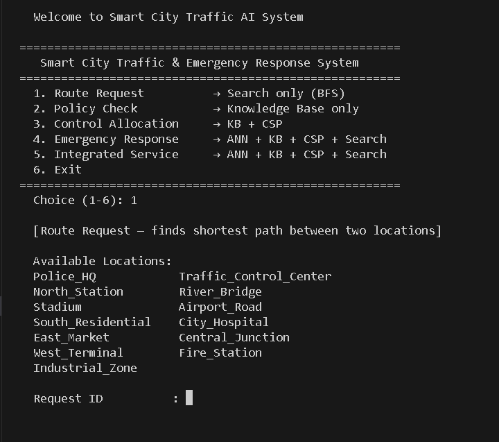
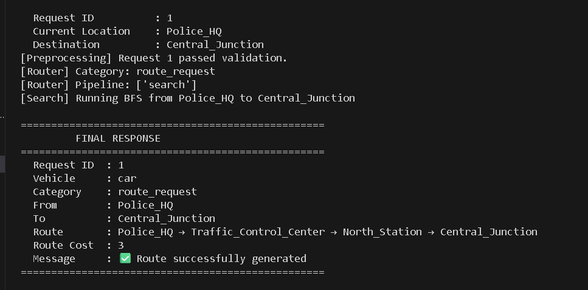
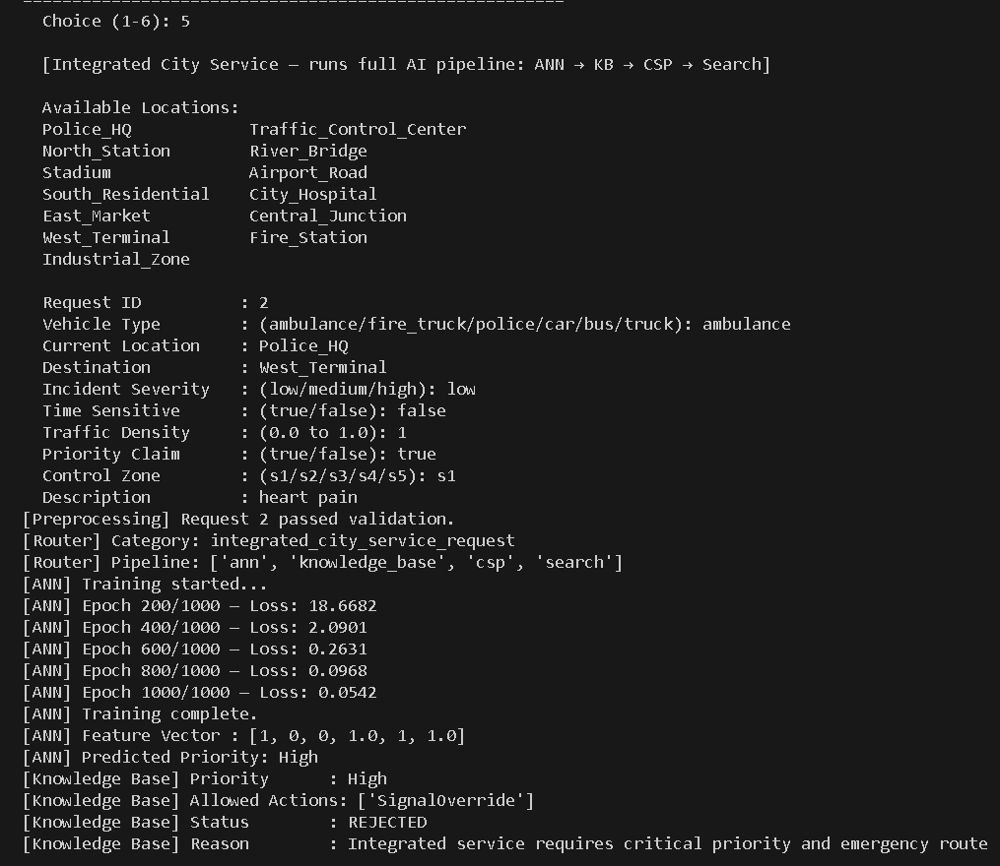
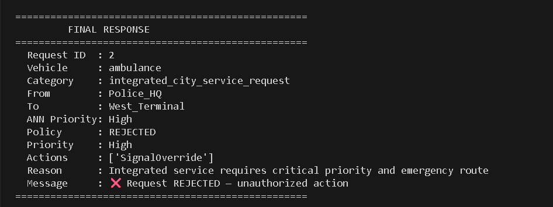

# Smart City Traffic & Emergency Response AI System

A modular AI pipeline that processes city traffic requests through multiple AI techniques — ANN, rule-based reasoning, CSP, and graph search — activating only the modules required for each request type.







---

## Why I Built This

Built as a final project for an AI lab course at FAST NUCES to demonstrate how multiple AI techniques can work together inside a single system rather than in isolation. The interesting part was designing the router — making sure each request type activates only the modules it actually needs, keeping the system explainable and efficient. Implementing the ANN and backpropagation from scratch using only NumPy made the math behind neural networks genuinely click.

---

## Tech Stack

- **Language:** Python 3.x
- **Libraries:** NumPy (ANN only)
- No ML frameworks — everything implemented from scratch

---

## Features

- **Modular pipeline router** — request type determines which modules activate; unused modules are fully skipped
- **ANN from scratch** — MLP with sigmoid activation and backpropagation built in NumPy; trained on 15 examples over 1000 epochs
- **Rule-based Knowledge Base** — logical predicates enforce traffic policy to approve or reject requests
- **CSP signal scheduler** — backtracking assigns conflict-free signal phases across 5 intersections with emergency override support
- **Three search algorithms** — BFS, UCS, and A* on a 13-node city graph; selected automatically based on request type

---

## Setup

```bash
git clone https://github.com/yourusername/smart-city-traffic-ai.git
cd smart-city-traffic-ai
pip install -r requirements.txt
```

---

## Usage

```bash
python main.py
```

Select a request type from the menu. Each option prompts only the fields relevant to its pipeline:

| Option | Pipeline Activated |
|---|---|
| Route Request | Search only (BFS) |
| Policy Check | Knowledge Base only |
| Control Allocation | KB + CSP |
| Emergency Response | ANN + KB + CSP + Search |
| Integrated Service | ANN + KB + CSP + Search |

For a full emergency pipeline demo, use `ambulance` as vehicle type with destination `City_Hospital`.

---

## Project Structure

```
smart-city-traffic-ai/
├── assets/                  # Screenshots for README
│   ├── pipeline.png
│   └── emergency.png
├── data/
│   └── city_graph.py
├── modules/
│   ├── ann.py
│   ├── csp.py
│   ├── knowledge_base.py
│   ├── preprocessing.py
│   ├── response.py
│   ├── router.py
│   └── search.py
├── main.py
├── requirements.txt
└── readme.md
```